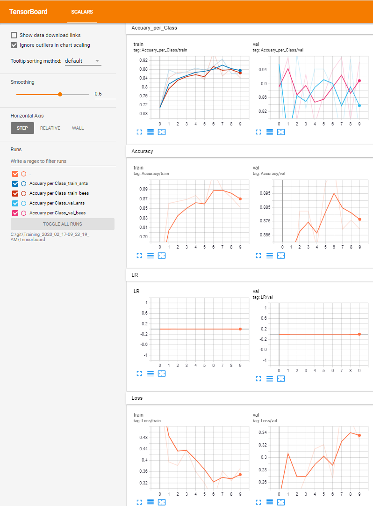

## Requirements
#### Python >= 3.7, CUDA Toolkit 10.1

#### Installation
Using [conda](https://docs.conda.io/en/latest/miniconda.html) for managing virtual environments.

    $ git clone https://github.com/RichLin56/Pytorch-Classification.git
    $ cd path/to/Pytorch-Classification/
    $ conda create -n pytorch_cls python==3.7
    $ activate pytorch_cls
    $ pip install -r requirements_windows.txt  
    

## Custom dataset
The custom dataset must contain training and validation images. If a testset is available it should be next to `train` and `val` folders as `test`.
#### Dataset structure
                    
        dataset           # path:  /path/to/dataset
         ├── train
         |    ├──classname_1
         |    |   └──image_1.png
         |    |   └──image_2.png
         |    |   └──...
         |    ├──classname_2
         |    |   └──...
         |    ├──...
         |        
         |    
         ├── val
         |    ├──classname_1
         |    |   └──image_1.png
         |    |   └──image_2.png
         |    |   └──...
         |    ├──classname_2
         |    |   └──...
         |    ├──...
         |        
         |  
         ├── test (Optional)
         |    ├──classname_1
         |    |   └──image_1.png
         |    |   └──image_2.png
         |    |   └──...
         |    ├──classname_2
         |    |   └──...
         |    ├──...
         
## Train
    $ cd path/to/Pytorch-Classification/
    $ activate pytorch_cls
    $ python train.py [-h] [-model MODEL_ARCHITECTURE] 
                      [-data DATA_DIR]
                      [-n NUM_CLASSES] 
                      [-b BATCH_SIZE] 
                      [-e NUM_EPOCHS]
                      [-o OUTPUT_DIR]
                      [-c CONFIG_FILE]
                      [-pt USE_PRETRAINED]
                      [-cp CHECKPOINT]
                      [-ft FEATURE_EXTRACT]
                      
## Configuration through train_config.json
The following settings for training can be configured through the train_config.json:
- **Optimizer**
  - All Optimizers from [torch.optim](https://pytorch.org/docs/stable/optim.html#algorithms) available
  - Parameters as dictionary keys & values (`see below for example in config.json` )
- **Learning Rate Scheduler**
  - All Learning Rate Schedulers from [torch.optim.lr_scheduler](https://pytorch.org/docs/stable/optim.html#how-to-adjust-learning-rate) available
  - Parameters as dictionary keys & values (`see below for example in config.json` )
- **Augmentation**
  - All Augmentation techniques from [torchvision.transforms](https://pytorch.org/docs/stable/torchvision/transforms.html) available
  - Transformations are executed from top to bottom (`see below for example in train_config.json` )

#### Example train_config.json
    {	
    	"training":
    		{		
    			"optimizer":  							
    			{
    				"name": "sgd",							
    				"lr": 0.001,
    				"momentum": 0.9								
    			},
    			"lr_scheduler":  							
    			{
    				"name": "ReduceLROnPlateau",							
    				"mode": "min",
    				"factor": 0.1,
    				"patience": 10,
    				"verbose": "True",
    				"threshold": 1e-4,
    				"threshold_mode": "rel",
    				"cooldown": 0,
    				"min_lr": 0,
    				"eps": 1e-8
    			},
    			"augmentation":  							
    			{
    				"train":
    				{
    					"RandomResizedCrop":
    					{					
    					"size": 224,
    					"scale": [0.4, 1.0],
    					"ratio": [0.75, 1.33]
    					},
    					"RandomHorizontalFlip":
    					{
    					"p": 0.5
    					},					
    					"Normalize":
    					{
    					"mean": [0.485, 0.456, 0.406],
    					"std": [0.229, 0.224, 0.225]
    					}					
    				},	
    				"val":
    				{
    					"Resize":
    					{
    					"size": 224,
    					"interpolatation": 2
    					},
    					"CenterCrop":
    					{
    					"size": 224
    					},					
    					"Normalize":
    					{
    					"mean": [0.485, 0.456, 0.406],
    					"std": [0.229, 0.224, 0.225]
    					}					
    				}						
    								
                }
            }	
    }

### Logging with Tensorboard
    $ activate pytorch_cls
    $ tensorboard --logdir path/to/output_dir/Tensorboard
    

## Evaluate Training afterwards with Testset
    $ cd path/to/Pytorch-Classification/
    $ activate pytorch_cls
    $ python eval.py [-h] [-model MODEL_ARCHITECTURE] 
                      [-data DATA_DIR]
                      [-n NUM_CLASSES] 
                      [-cp CHECKPOINT]
                      [-o OUTPUT_DIR]
                      [-c CONFIG_FILE]   
      
## Configuration through eval_config.json
The following settings for evaluation with a testset can be configured through the eval_config.json:
- **Augmentation**
  - You should use the same settings here as in your eval_config.json
  - All Augmentation techniques from [torchvision.transforms](https://pytorch.org/docs/stable/torchvision/transforms.html) available
  - Transformations are executed from top to bottom (`see below for example in eval_config.json` )
                      
#### Example eval_config.json               
    {	
        "evaluation":
            {			
                "augmentation":  							
                {	
                    "val":
                    {
                        "Resize":
                        {
                        "size": 224,
                        "interpolatation": 2
                        },
                        "CenterCrop":
                        {
                        "size": 224
                        },					
                        "Normalize":
                        {
                        "mean": [0.485, 0.456, 0.406],
                        "std": [0.229, 0.224, 0.225]
                        }					
                    }				

                }
            }	
    }
    

## Predict on new images
    $ cd path/to/Pytorch-Classification/
    $ activate pytorch_cls
    $ python predict.py [-h] [-model MODEL_ARCHITECTURE] 
                        [-data DATA_DIR]
                        [-n NUM_CLASSES] 
                        [-cp CHECKPOINT]
                        [-ext EXTENSION]
                        [-c CONFIG_FILE]
                        [-o OUTPUT_DIR]
                        [-gpu USE_GPU]
                        
## Configuration through predict_config.json
The following settings for evaluation with a testset can be configured through the predict_config.json:
- **save_images**
  - Save all predictions into output_dir
- **class_to_label**
- **Augmentation**
  - Use the same settings here as in train_config.json 
  - All Augmentation techniques from [torchvision.transforms](https://pytorch.org/docs/stable/torchvision/transforms.html) available
  - Transformations are executed from top to bottom (`see below for example in predict_config.json` )

#### Example predict_config.json   
    {	
        "prediction":
            {	
                "save_images": "True",
                "class_to_label":
                {
                    "0" : "ants",
                    "1" : "bees"
                },		
                "augmentation":  							
                {	
                    "val":
                    {
                        "Resize":
                        {
                        "size": 224,
                        "interpolatation": 2
                        },
                        "CenterCrop":
                        {
                        "size": 224
                        },					
                        "Normalize":
                        {
                        "mean": [0.485, 0.456, 0.406],
                        "std": [0.229, 0.224, 0.225]
                        }					
                    }										
                }
            }	
    }
                        

### Classification-Performances of the implemented models on ImageNet

| Network | Top-1 error | Top-5 error | # Params |
| ------ | ------ | ------ | ------ |
|VGG-11 | 29.62|           10.19|    |
|VGG-13 | 28.45|           9.63|    |
|VGG-16 | 26.63|           8.50|    |
|VGG-19 | 25.76|           8.15|    |
|ResNet-18                        | 30.24|           10.92|    |
|ResNet-34                        | 26.70|           8.58|    |
|ResNet-50                        | 23.85|           7.13| 26M   |
|ResNet-101                       | 22.63|           6.44|    |
|ResNet-152                       | 21.69|           5.94| 60M   |
|SqueezeNet 1.1                   | 41.81|           19.38|    |
|Densenet-121                     | 25.35|           7.83|    |
|Densenet-169                     | 24.00|           7.00| 14M   |    
|Densenet-201                     | 22.80|           6.43|    |
|Densenet-161                     | 22.35|           6.20|    |
|Inception v3                     | 22.55|           6.44| 24M   |
|ShuffleNet V2                    | 30.64|           11.68|    |
|MobileNet V2                     | 28.12|           9.71|    |
|ResNeXt-50-32x4d                 | 22.38|           6.30|    |
|ResNeXt-101-32x8d                | 20.69|           5.47| 84M   |
|Wide ResNet-50-2                 | 21.49|           5.91|    |
|Wide ResNet-101-2                | 21.16|           5.72|    |
|MNASNet 1.0                      | 26.49|           8.456|    |
|efficientnet-b0                  | 27.3|           6.5| 5.3M   |
|efficientnet-b1                  | 21.2|           5.5| 7.8M   |
|efficientnet-b2                  | 20.2|           5.0| 9.2M   |
|efficientnet-b3                  | 18.9|           4.4| 12M   |
|efficientnet-b4                  | 17.4|           3.7| 19M   |
|efficientnet-b5                  | 16.7|           3.3| 30M   |
|efficientnet-b6                  | 16.0|           3.2| 43M   |
|efficientnet-b7                  | 15.6|           2.9| 66M   |

## To Do:

- [ ] Convert print() to logging
- [ ] Save args and config in Outputdir
- [ ] Criterion settings in config file
- [ ] Use docker for project setup
- [x] Prediction routine (no labels available)
- [x] Requirements for linux
- [x] Test routine
- [x] Outputdir settings in config file
- [x] Scheduler settings in config file
- [x] Add config file
- [x] Different optimizer in config file
- [x] Augmentation settings in config file
- [x] Log with Tensorboard
- [x] Write Read-Me which explains how to setup a custom dataset

